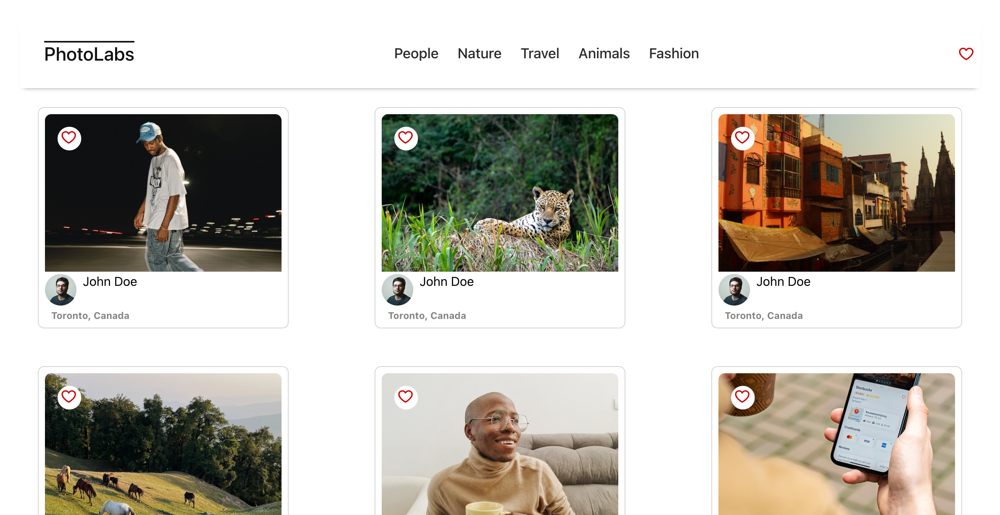

# react-photolabs
Welcome to the PhotoLabs project! This repository contains the code for the Web Development React course.

# Photolabs
PhotoLabs is a web application that allows users to explore and interact with a collection of photos. Users can browse through different topics, view detailed information about each photo, and interact with the favorite feature.




## Setup

Install dependencies with `npm install` in each respective `/frontend` and `/backend`.

## [Frontend] Running Webpack Development Server

```sh
cd frontend
npm start
```

## [Backend] Running Backend Servier

Read `backend/readme` for further setup details.

```sh
cd backend
npm start
```
